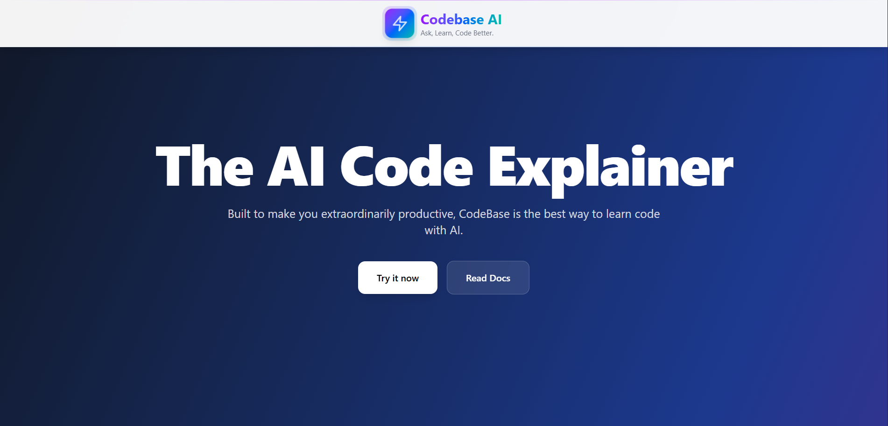

# 🚀 Codebase AI

> **The AI Code Explainer** - Built to make you extraordinarily productive, Codebase AI is the best way to understand and interact with codebases using AI.

[](https://reactjs.org/)
[](https://fastapi.tiangolo.com/)
[](https://python.org/)
[](https://langchain.com/)
[](LICENSE)


## Preview


## 📋 Table of Contents

- [Overview](#overview)
- [Features](#features)
- [Tech Stack](#tech-stack)
- [Architecture](#architecture)
- [Installation](#installation)
- [Usage](#usage)
- [API Documentation](#api-documentation)
- [How It Works](#how-it-works)
- [Contributing](#contributing)
- [License](#license)

## 🎯 Overview

Codebase AI is a powerful web application that combines modern AI technology with intuitive design to help developers understand complex codebases. Simply load a repository, ask questions about the code, and get instant, intelligent explanations powered by advanced language models and RAG (Retrieval-Augmented Generation) technology.

### Key Capabilities

- **🔍 Code Analysis**: AI-powered understanding of complex codebases
- **💬 Smart Q&A**: Ask questions about any part of your code and get detailed explanations
- **📁 Multi-Language Support**: Works with JavaScript, TypeScript, Python, and more
- **⚡ Real-time Processing**: Lightning-fast analysis with streaming responses
- **🔒 Secure & Private**: Enterprise-grade security with encrypted data transmission
- **☁️ Cloud Infrastructure**: Scalable architecture ensuring 99.9% uptime

## ✨ Features

### Frontend Features
- **Modern UI/UX**: Beautiful, responsive design with dark theme and gradient backgrounds
- **Interactive Components**: Smooth animations and transitions using Framer Motion
- **Real-time Feedback**: Live status updates and progress indicators
- **Mobile Responsive**: Optimized for all device sizes
- **Syntax Highlighting**: Code blocks with proper formatting and copy functionality

### Backend Features
- **RAG Implementation**: Retrieval-Augmented Generation for accurate code explanations
- **Multi-Model Support**: Integration with HuggingFace models and custom embeddings
- **File Processing**: Automatic detection and processing of various file types
- **Chunking Strategy**: Intelligent text splitting for optimal context handling
- **Vector Database**: ChromaDB for efficient similarity search

## 🛠 Tech Stack

### Frontend
- **React 18+** - Modern UI framework
- **Vite** - Fast build tool and development server
- **Tailwind CSS** - Utility-first CSS framework
- **Framer Motion** - Animation library for smooth interactions
- **React Icons** - Comprehensive icon library

### Backend
- **FastAPI** - Modern, fast web framework for building APIs
- **Python 3.8+** - Core programming language
- **LangChain** - Framework for developing applications with LLMs
- **ChromaDB** - Vector database for embeddings storage
- **HuggingFace Transformers** - Pre-trained models and tokenizers
- **PyTorch** - Deep learning framework
- **Uvicorn** - ASGI server for FastAPI

### AI/ML Components
- **RAG (Retrieval-Augmented Generation)** - For context-aware responses
- **AI Models** - Qwen2.5-1.5B-Instruct for code understanding
- **Embeddings** - BAAI/bge-small-en-v1.5 for semantic search
- **Text Processing** - Recursive character text splitting
- **Vector Search** - Similarity-based document retrieval

### Infrastructure
- **ngrok** - Secure tunneling for development and testing
- **CORS** - Cross-origin resource sharing
- **GitPython** - Git repository interaction
- **Swagger/OpenAPI** - API documentation

## 🏗 Architecture

```
┌─────────────────┐    ┌─────────────────┐    ┌─────────────────┐
│   Frontend      │    │   Backend API   │    │   AI Pipeline   │
│   (React)       │◄──►│   (FastAPI)     │◄──►│   (LangChain)   │
│                 │    │                 │    │                 │
│ • Hero Section  │    │ • Load Repo     │    │ • RAG System    │
│ • About         │    │ • Ask Questions │    │ • Embeddings    │
│ • How It Works  │    │ • File Analysis │    │ • Vector DB     │
│ • Repo Loader   │    │ • Health Check  │    │ • LLM Models    │
│ • Ask Box       │    │                 │    │                 │
│ • Footer        │    │                 │    │                 │
└─────────────────┘    └─────────────────┘    └─────────────────┘
```

### Data Flow

1. **Repository Loading**: User provides GitHub URL or local path
2. **Document Processing**: Files are loaded, split, and embedded
3. **Vector Storage**: Embeddings stored in ChromaDB
4. **Query Processing**: User questions are embedded and matched
5. **Context Retrieval**: Relevant code snippets retrieved
6. **Response Generation**: LLM generates explanations using context

## 🚀 Installation

### Prerequisites

- **Node.js** 16+ and npm
- **Python** 3.8+
- **Git** for repository cloning

### Frontend Setup

```bash
# Clone the repository
git clone https://github.com/yourusername/codebase-ai.git
cd codebase-ai

# Install dependencies
npm install

# Start development server
npm run dev
```

### Backend Setup

```bash
# Install Python dependencies
pip install fastapi uvicorn pyngrok gitpython transformers torch langchain langchain-community chromadb bitsandbytes nest_asyncio

# Run the FastAPI server
python main.py
```

### Environment Variables

Create a `.env` file in the root directory:

```env
# ngrok token for tunneling (optional)
NGROK_TOKEN=your_ngrok_token_here

# API configuration
API_BASE_URL=http://localhost:8000
```

## 📖 Usage

### 1. Load a Repository

Enter a GitHub repository URL or local path in the Repo Loader section:

```
https://github.com/username/repository.git
```

### 2. Ask Questions

Once the repository is loaded, you can ask questions like:

- "What does the main.py file do?"
- "Explain the authentication system"
- "How does the database connection work?"
- "What are the main components of this project?"

### 3. File-Specific Analysis

Use the special syntax for file explanations:

```
explain file src/components/Header.jsx
explain file main.py
explain file package.json
```

## 📚 API Documentation

### Endpoints

#### `POST /load_repo`
Load a repository for analysis.

**Parameters:**
- `repo_url` (string): GitHub URL or local path

**Response:**
```json
{
  "status": "success",
  "repo_root": "/path/to/repo"
}
```

#### `POST /ask`
Ask a question about the loaded repository.

**Request Body:**
```json
{
  "question": "What does this function do?"
}
```

**Response:**
```json
{
  "answer": "This function handles user authentication..."
}
```

#### `GET /health`
Check API health status.

**Response:**
```json
{
  "status": "ok"
}
```

### Interactive API Documentation

Visit `http://localhost:8000/docs` for Swagger UI documentation.

## 🔧 How It Works

### 1. Repository Processing

```python
# Load documents from repository
documents = load_documents(repo_path)

# Split documents into chunks
docs = split_docs(documents)

# Create embeddings and store in vector database
db = build_db(docs)
```

### 2. Question Answering

```python
# Create RAG chain
qa = RetrievalQA.from_chain_type(
    llm=llm,
    retriever=retriever,
    chain_type="stuff",
    chain_type_kwargs={"prompt": EXPLAIN_PROMPT}
)

# Generate answer
answer = qa.run(question)
```

### 3. File Analysis

For large files, the system automatically chunks the content and provides part-by-part explanations, then synthesizes them into a coherent response.

## 🎨 UI Components

### Hero Section
- Clean, modern design with gradient background
- Call-to-action buttons for downloads
- Responsive layout for all devices

### About Section
- Technology showcase with interactive cards
- Responsive grid layout
- Hover animations and effects

### How It Works
- Step-by-step process visualization
- Futuristic design with floating elements
- Smooth animations and transitions

### Interactive Features
- Repository loader with real-time feedback
- Question input with syntax highlighting
- AI response display with code formatting

## 🤝 Contributing

We welcome contributions! Please follow these steps:

1. **Fork** the repository
2. **Create** a feature branch (`git checkout -b feature/amazing-feature`)
3. **Commit** your changes (`git commit -m 'Add amazing feature'`)
4. **Push** to the branch (`git push origin feature/amazing-feature`)
5. **Open** a Pull Request

### Development Guidelines

- Follow the existing code style
- Add tests for new features
- Update documentation as needed
- Ensure all tests pass before submitting

## 📄 License

This project is licensed under the MIT License - see the [LICENSE](LICENSE) file for details.

## 🙏 Acknowledgments

- **HuggingFace** for pre-trained models and transformers library
- **LangChain** for the RAG framework and document processing
- **FastAPI** for the modern Python web framework
- **React** team for the amazing frontend framework
- **Tailwind CSS** for the utility-first CSS framework

## 📞 Support

- **Documentation**: [Wiki](https://github.com/yourusername/codebase-ai/wiki)
- **Issues**: [GitHub Issues](https://github.com/yourusername/codebase-ai/issues)
- **Discussions**: [GitHub Discussions](https://github.com/yourusername/codebase-ai/discussions)

---

**Built with ❤️ for developers** - Made by HASSAN JAMSHAID
